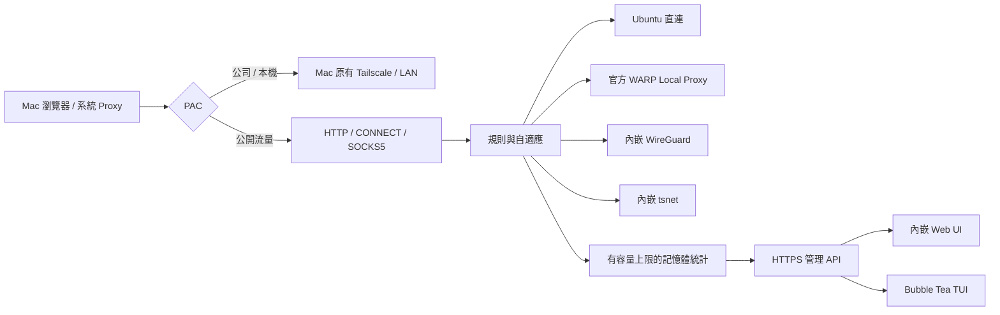

# 分流與管理契約

## 資料路徑

## 規則

網域先轉小寫並移除結尾句點。`domains` 精確比對；`suffixes` 同時匹配本身與子網域，`example.com` 不會匹配 `notexample.com`。同類固定規則依設定順序，固定規則始終優先於自適應規則。要讓既有固定網域改用自適應，需移除／修改該固定規則。

CIDR 僅匹配 Proxy 客戶端給的 IP literal。系統不會先用 Ubuntu 的 DNS 解析 hostname 再套 CIDR，避免在選定出口前洩漏名稱。網域流量請使用網域規則；要求 `ipv4`、`ipv6` 或 `auto` 會傳入該出口。WARP 的遠端 SOCKS DNS 無法保證 hostname 強制 family，會回報不支援。

預設 `github.com`、`api.github.com`、`codeload.github.com` 直連；`raw.githubusercontent.com`、`avatars.githubusercontent.com`、`release-assets.githubusercontent.com`、`objects.githubusercontent.com` 與 `githubassets.com` suffix 固定 WARP。這是可編輯的起點，不宣稱 GitHub 所有 CDN 名稱都已列完。

解析由出口擁有：direct 使用系統 resolver；WARP 將 hostname 交給上游 SOCKS；WireGuard 用設定內的隧道 DNS；Tailscale 用其 MagicDNS 或明確配置的公司 DNS。不設跨出口共享的 DNS cache；底層 resolver 的快取不會被拿來為另一個出口選路。私有名稱解析失敗不改用公共 resolver。私網與公司 bypass 名稱不得經 WARP，也不參與自適應；若明確建立固定規則，可使用公司 WireGuard，即使該出口同時具備公網能力。預設公網 WireGuard 不會自行接手私網目的地。

## 自適應

預設關閉。選擇具公網能力的 direct、WARP、WireGuard；不使用 Tailscale 公司出口。每個 `host:port` 和 requested family 分開決策；`auto` 比較整段建連路徑，不把未知 WARP IP 宣稱成 IPv4 或 IPv6。連線快不代表傳輸吞吐快。

預設十分鐘窗口、至少三個成功樣本，候選連續兩輪比目前出口快至少 25% **且** 50 ms，且滿十分鐘冷卻才切換。連續三次逾時、有近期成功的替代出口時可提前切換。相同的舊證據不算新一輪改善。

探測只對近期使用的公開 80／443 目的地做 TCP connect，最多每分鐘十二次、同時兩次、單次四秒；不下載測速檔、不重播 HTTP 請求。被手動停用／停止的出口不會因探測重新連線。新決策只影響新連線，既有下載持續使用原出口。

## 可觀察資料

每條已建立連線最多保存 hostname、port、已知目的 IP、family、流量、五秒窗口速率、建連時間、規則及出口。最多 2,048 條 flow 與 2,048 個自適應目的地；超過容量移除最舊資料，24 小時過期。統計不落盤，不記錄 payload、HTTPS path、cookie 或授權 header；畫面總計僅涵蓋保留的 flows。

WARP SOCKS 回應通常無法告知真正遠端 IP，會顯示未知，不使用本機 `127.0.0.1:40000` 假冒目的 IP。DNS、傳輸失敗與實際速度不能單靠 IP 城市推論；診斷只列出可實測的資料與回應提供的 CDN header。

## 管理 API

所有 `/api/v1` 請求需 `Authorization: Bearer <token>`。Web UI 的 token 只保存在該 tab 的 session storage；URL 不帶秘密。跨來源寫入拒絕。TLS 驗證不可關閉；TUI 可提供信任的 PEM 憑證。

| 方法與路徑 | 行為 |
|---|---|
| GET `/api/v1/config` | 目前生效設定與 revision，秘密為檔案參照 |
| PUT `/api/v1/config` | 完整設定，revision 必須與目前一致，成功後遞增 |
| GET `/api/v1/stats` | flows、destinations、totals、config_revision、applied_at |
| GET `/api/v1/outbounds` | profile 狀態與可驗證的健康資訊 |
| POST `/api/v1/outbounds/{id}/{action}` | `{"value":"..."}`，執行出口支援的動作 |

設定驗證、provider 建立、私有檔案原子寫入完成後才套用。無效更新與寫入失敗保留原設定；409 表示其他介面已更新版本。listener、ACL、TLS／登入安全設定，以及使用同一 state directory 的執行中 Tailscale 變更，需要在本機修改檔案並重啟 daemon。改變出口時會保留舊 provider，直到既有連線結束才釋放。
